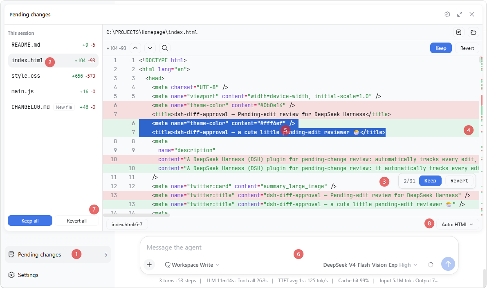

# dsh-diff-approval

English | [中文](README.zh.md)

[](https://www.npmjs.com/package/dsh-diff-approval)
[](https://github.com/9087/dsh-diff-approval/actions)

A DeepSeek Harness (DSH) plugin for pending-change review: it automatically tracks every successful `edit`, `write`, and editor (`str_replace_editor`) mutation, folds them into a single pending list in the sidebar where each file's diff can be reviewed and kept/reverted — and it can also import the workspace's version-control repository's local changes (Git / SVN / Perforce) in one click.



The numbered markers (① – ⑧) in the screenshot point to the matching details described below.

## ✨ Features

- **Diff view**: syntax-highlighted whole-file diff ⑤ with +/− counts, an overview ruler ④ on the scrollbar showing where changes sit, and an in-file search (`Ctrl+F`). Rows are virtualized, so huge files stay smooth.
- **Block navigation & decisions**: jump between change blocks with `Ctrl+↑/↓` (or the previous/next buttons) — the focused block flashes. Hover a block to **Keep** or **Revert** just that block from a small actions frame ③ that also shows its position (e.g. "2/5").
- **Per-file and bulk decisions**: the files in the file list ② can be kept / reverted one at a time, or **Keep all** / **Revert all** from its footer.
- **Undo / Redo**: every keep, revert, and import is undoable with `Ctrl+Z` / `Ctrl+Y` (active while the panel is open; text inputs keep their own editing).
- **Line references**: select text in the diff — the status bar shows its `file:start-end` reference ⑦; click it (or press `Ctrl+L`) to copy, and with the setting on it auto-pastes into the composer ⑥ and focuses it.
- **Highlight language**: auto-detected from the file extension, or overridden from a dropdown ⑧.
- **External changes**: files already in the pending list are monitored — if one is later modified outside the reviewed edits (another tool, an editor), the panel adopts the new content and flags the divergence.
- **Open / Reveal**: while reviewing a file's diff, open it in its default app or reveal it in the system file manager with one click.
- **Import workspace changes**: when the list is empty, click the button to import the workspace's local changes from **Git / SVN / Perforce** — modified, deleted, and (opt-in) untracked files. The VCS root is found by walking up from the workspace, so a workspace inside a subdirectory works too.
- **Settings**: a "Diff Approval" section in DeepSeek Harness settings with the preferences for auto-paste on copy and whether untracked files are included when importing.
- **Persistence**: pending state is stored per workspace at `<dshHome>/diff-approval/workspaces/<workspaceId>.json` and survives restarts — unhandled changes are still there when you come back, even in a fresh session.

## 📦 Install

If `dsh` is on your `PATH`:

```sh
dsh plugin --profile web add dsh-diff-approval
```

Or, if you run the harness through npx (e.g. `npx @deepseek-ai/dsh web`):

```sh
npx @deepseek-ai/dsh plugin --profile web add dsh-diff-approval
```

or manually: add the package to your profile's `package.json` dependencies and insert this row into the profile's `cordis.patch.yml`:

```yaml
- insert:
    - id: diff-approval
      name: dsh-diff-approval
      # Optional: relocate durable pending state (defaults to
      # <dshHome>/diff-approval/workspaces).
      # config:
      #   storageDir: ~/dsh-pending
```

Then restart `dsh web`.

## 🚀 Usage

1. Work with the agent as usual — successful `edit` / `write` / editor (`str_replace_editor`) calls are recorded automatically.
2. Click the **Pending changes** action ① at the sidebar footer, review each file's diff, and **Keep** / **Revert**.
3. When the list is empty, **Import workspace changes** pulls in the workspace's local Git/SVN/Perforce changes.

## 📝 Notes

- Only tracked mutations (`edit`, `write`, and `str_replace_editor` editor calls) are recorded automatically. Deletions made outside these tools (e.g. shell `rm`) are sensed only for tracked files: the entry turns "File is gone" and its Revert restores the file.
- The VCS import runs read-only Git/SVN/Perforce commands through the deployment's shell executor, so the respective CLI must be on `PATH`. Importing untracked files (default off) scans the whole workspace, which can be slow on large trees.
- Reverting a created file deletes it (the fs seam has no delete API).
- Sessions with no workspace keep their entries memory-only; corrupt persistence files are rejected and can be deleted to reset.

## 🛠 Development

```sh
corepack pnpm install
pnpm run typecheck   # tsc over both faces
pnpm run build       # emits lib/index.js and lib/client.js
pnpm test
```
