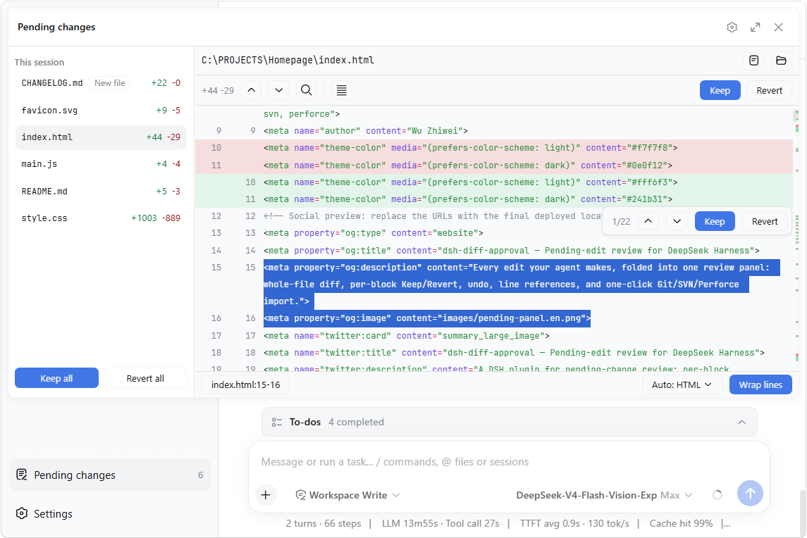
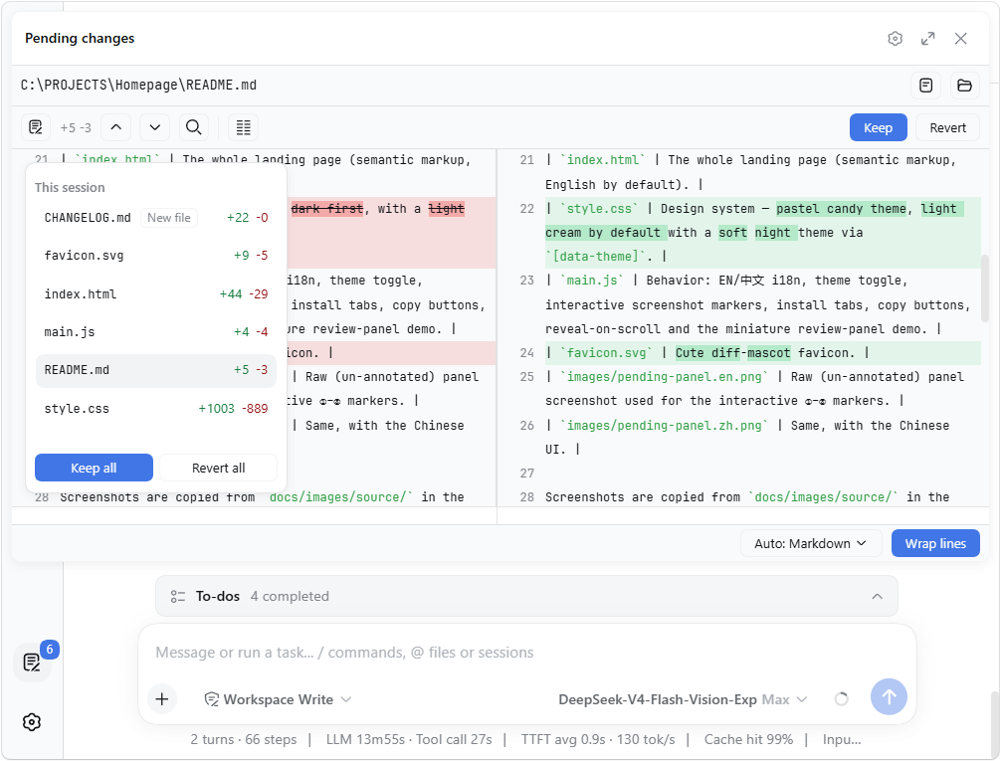
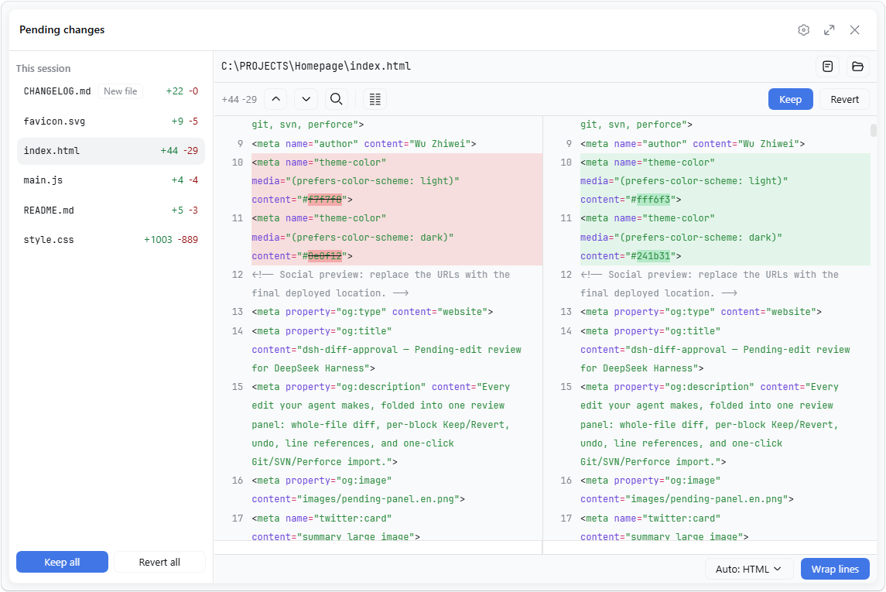
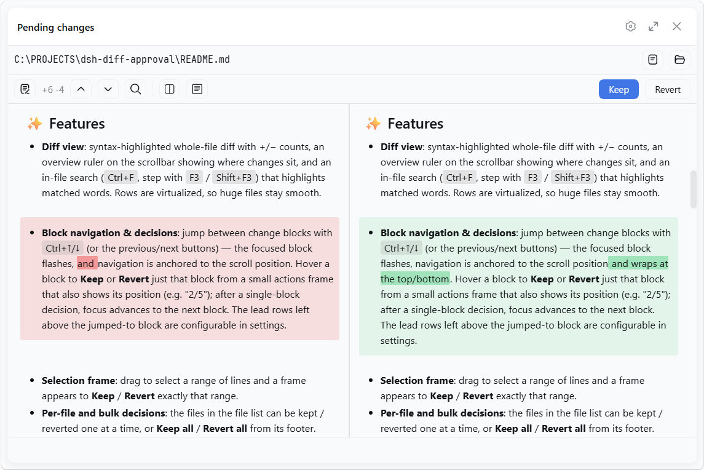

# dsh-diff-approval

English | [中文](README.zh.md)

[](https://www.npmjs.com/package/dsh-diff-approval)
[](https://github.com/9087/dsh-diff-approval/actions)
[)](https://github.com/9087/dsh-diff-approval/actions/workflows/compat.yml)
[)](https://github.com/9087/dsh-diff-approval/actions/workflows/compat-newer.yml)
[](https://github.com/9087/dsh-diff-approval/actions/workflows/release.yml)

A DeepSeek Harness (DSH) plugin for pending-change review: it automatically tracks every successful `edit`, `write`, and editor (`str_replace_editor`) mutation, folds them into a single pending list in the sidebar where each file's diff can be reviewed and kept/reverted — and it can also import the workspace's version-control repository's local changes (Git / SVN / Perforce) in one click.



The panel also collapses its file list into a floating card; while floating, each of its four edges — the left sidebar, the header above, the right sidebar, the composer below — can be chosen to be covered (all four is what used to be fullscreen, and covering nothing is a plain floating card), and it can dock as a tab in the right sidebar:

Two entries open it: the row at the sidebar foot, and a button in the Session header's right-hand controls — the cluster the app keeps its own per-session actions in (where "Download session log" lives) — so the review stays one click away with the sidebar collapsed or hidden.

| Collapsed file list | Covering everything |
| --- | --- |
|  |  |

For Markdown files, the source-line diff can also be shown as a rendered before/after preview:



## ✨ Features

- **Diff view**: syntax-highlighted whole-file diff with +/− counts, an overview ruler on the scrollbar showing where changes sit, and an in-file search (`Ctrl+F`, step with `F3` / `Shift+F3`) that highlights matched words. Rows are virtualized, so huge files stay smooth. The line-number column keeps a surface of its own — a shade lighter than the code block, so the numbers read as a column rather than as part of the code — and stays pinned while the code scrolls sideways.
- **Block navigation & decisions**: jump between change blocks with `Ctrl+↑/↓` (or the previous/next buttons) — the focused block flashes, navigation is anchored to the scroll position and wraps at the top/bottom. Hover a block to **Keep** or **Revert** just that block from a small actions frame that also shows its position (e.g. "2/5"); after a single-block decision, focus advances to the next block. The lead rows left above the jumped-to block are configurable in settings.
- **Selection frame**: drag to select a range of lines and a frame appears to **Keep** / **Revert** exactly that range.
- **Per-file and bulk decisions**: the files in the file list can be kept / reverted one at a time, or **Keep all** / **Revert all** from its footer.
- **Resolved files stay listed**: once every change in a file has been kept/reverted, the entry remains in the list and the panel asks whether to remove it or keep it there.
- **Undo / Redo**: every keep, revert, import, and comment is undoable with `Ctrl+Z` / `Ctrl+Shift+Z` (rebindable in Shortcuts; `Ctrl+Y` remains an alias), active while the panel is open — text inputs keep their own editing.
- **Quick summon & file cycling**: `Ctrl+D` (configurable in settings) toggles the review panel from anywhere and `Esc` closes it; the panel is also one click away from the sidebar-foot row and from a button in the Session header beside the app's own controls; `Ctrl+Tab` / `Ctrl+Shift+Tab` cycle through the pending files.
- **Line references**: select text in the diff — the status bar shows its `(file:line)` / `(file:start-end)` reference; click it (or press `Ctrl+L`) to copy, and with the setting on it auto-pastes into the composer and focuses it. References in the composer and queued messages are **auto-aligned** when the referenced file changes: surviving lines re-map to their new range, and a fully-removed line becomes `(file:LINE_MISSING)`.
- **Highlight language**: auto-detected from the file extension, or overridden from a dropdown.
- **Auto-wrap**: a "Wrap lines" toggle beside the language selector wraps long lines for that language (CJK breaks between characters, Latin words stay whole), remembered per language.
- **Side-by-side split view**: an opt-in two-column diff (left "before" | right "current"), line-aligned with per-side horizontal scrolling and a shared vertical scrollbar. Toggle it from the toolbar or in settings (default: single-column unified view). In split view, changed blocks are aligned by content similarity and changed lines show intra-line word diffs — whole words for Latin text, per-character for CJK.
- **Markdown preview**: for Markdown files, toggle between the source-line diff and a rendered before/after preview (`Preview` / `Source`). The preview content max width is configurable.
- **Customizable appearance**: from the "Diff view" settings group, adjust the diff's code font size (%), line height (px), the added / removed line colors, and the tab width (2 / 4 / 8 spaces), with a live preview.
- **Comments & annotations**: select any lines and write a comment. The card is anchored below the selected lines and holds the discussion with the agent. Comment mode is on by default and can be turned off in settings. The agent can comment on its own (annotate): asking it to annotate a piece of code is one way to read that code faster. Say "annotate this project's startup flow for me" and it marks the entry point, the initialisation order and the important branches, line by line, to be read in order. In the side-by-side view the comment quotes both sides of the change, the removed lines and the added ones, so the agent reads the whole replacement.
- **File menu**: on by default (the "File menu" row in the "Diff view" group turns it off). It takes over the click on some file links: a file row in the shell's edited / produced lists, an `@file` reference or file link in a message, and a relative link in this plugin's Markdown preview, and offers: **Open as usual** (the shell's own behaviour, replayed), **View in the review panel**, and **Copy file path**.
- **Bundled CJK code font**: the panel ships JetBrains Maple Mono, subset and sliced by `unicode-range`; it is on by default and can be turned off in settings.
- **External changes**: files already in the pending list are monitored — if one is later modified outside the reviewed edits (another tool, an editor), the panel adopts the new content and flags the divergence.
- **Open / Reveal**: while reviewing a file's diff, open it in its default app or reveal it in the system file manager with one click.
- **Import version-control changes**: when the list is empty, click the button to import the workspace's local changes from **Git / SVN / Perforce** — everything that is **not committed yet, staged or not** (Git is read against the last commit, the `git diff HEAD` view), plus deleted files and, opt-in, files the VCS has never seen (untracked / unversioned). The VCS root is found by walking up from the workspace, so a workspace inside a subdirectory works too.
- **Persistence**: pending state is stored per workspace at `<dshHome>/diff-approval/workspaces/<workspaceId>.json` and survives restarts — unhandled changes are still there when you come back, even in a fresh session.

## 📦 Install

If `dsh` is on your `PATH`:

```sh
dsh plugin --profile web add dsh-diff-approval
```

Or, if you run the harness through npx (e.g. `npx @deepseek-ai/dsh web`):

```sh
npx @deepseek-ai/dsh plugin --profile web add dsh-diff-approval
```

or manually: add the package to your profile's `package.json` dependencies and insert this row into the profile's `cordis.patch.yml`:

```yaml
- insert:
    - id: diff-approval
      name: dsh-diff-approval
      # Optional: relocate durable pending state (defaults to
      # <dshHome>/diff-approval/workspaces).
      # config:
      #   storageDir: ~/dsh-pending
```

Then restart `dsh web`.

## 🚀 Usage

1. Work with the agent as usual — successful `edit` / `write` / editor (`str_replace_editor`) calls are recorded automatically.
2. Click the **Pending changes** action at the sidebar footer, review each file's diff, and **Keep** / **Revert**.
3. When the list is empty, **Import version-control changes** pulls in what the workspace has not committed yet.

## 📝 Notes

- Only tracked mutations (`edit`, `write`, and `str_replace_editor` editor calls) are recorded automatically. Deletions made outside these tools (e.g. shell `rm`) are sensed only for tracked files: the entry turns "File is gone" and its Revert restores the file.
- The VCS import runs read-only Git/SVN/Perforce commands through the deployment's shell executor, so the respective CLI must be on `PATH`. Including files version control has not seen (default off) scans the whole workspace, which can be slow on large trees.
- For a newly-created file, the whole-file revert action reads **Delete** and removes the file.
- Reverting a file writes it back with its current line endings (LF / CRLF) preserved.
- Sessions with no workspace keep their entries memory-only; corrupt persistence files are rejected and can be deleted to reset.
- The sidebar footer entry stacks vertically with other plugins' footer actions and defers to the dedicated `dsh-footer-order` plugin when it is present.

## 🛠 Development

Development setup, the command list, the two halves' reload rules and the font pipeline: [`DEVELOP.md`](DEVELOP.md).
