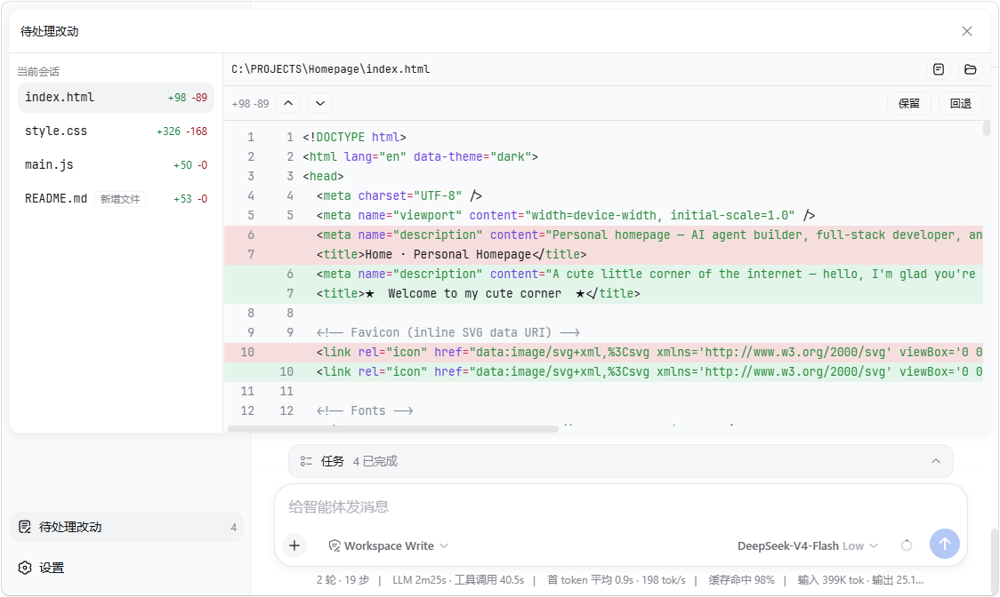

# dsh-diff-approval

[English](README.md) | 中文

[](https://www.npmjs.com/package/dsh-diff-approval)
[](https://github.com/9087/dsh-diff-approval/actions)

一个 DeepSeek Harness（DSH）待处理改动审核插件：自动跟踪每次成功的 `edit` / `write` / 编辑器（`str_replace_editor`）改动，把一个文件的全部未处理改动合并为一条待处理条目，在侧边栏展示每个文件的完整差异，支持保留 / 回退——全程不依赖 git。



## ✨ 功能

- **差异视图**：语法高亮与 +/− 统计，按差异块跳转（上一处 / 下一处），拖选即可复制行引用。
- **保留 / 回退**：每个文件一次决定。保留即接受；回退把文件写回最早基准（新建文件则删除，已被删除的跟踪文件则恢复）。
- **打开 / 定位**：从 diff 头部即可在默认应用中打开文件，或在文件管理器中定位它。
- **持久化**：待处理状态按 workspace 落盘至 `<dshHome>/diff-approval/workspaces/<workspaceId>.json`，跨重启保留——回来时未处理的改动仍在，即便换了新会话。

## 📦 安装

若 `dsh` 已在 `PATH` 中：

```sh
dsh plugin --profile web add dsh-diff-approval
```

若通过 npx 启动 harness（如 `npx @deepseek-ai/dsh web`）：

```sh
npx @deepseek-ai/dsh plugin --profile web add dsh-diff-approval
```

或手动：把本包加入 profile 的 `package.json` 依赖，并在该 profile 的 `cordis.patch.yml` 中加入：

```yaml
- insert:
    - id: diff-approval
      name: dsh-diff-approval
      # 可选：把落盘位置迁到别处（默认是
      # <dshHome>/diff-approval/workspaces）。
      # config:
      #   storageDir: ~/dsh-pending
```

然后重启 `dsh web`。

## 🚀 用法

1. 照常和 agent 对话——成功的 `edit` / `write` 调用会自动记录。
2. 点击侧边栏底部的 **待处理改动** 入口（角标显示数量）。
3. 点击文件行展开该文件的完整差异，用 **上一处差异** / **下一处差异** 在差异块间跳转。
4. **保留** 接受该文件的改动；**回退** 恢复其最早基准。处理后该行离开列表。

## 📝 注意事项

- 只记录被跟踪的改动（`edit`、`write` 与编辑器 `str_replace_editor` 调用）。通过以上工具以外的删除（如 shell `rm`）只能对已跟踪的文件感知：条目显示"文件已不存在"，回退即恢复。
- 回退新建文件会删除该文件（文件系统接缝没有删除 API）。
- 没有 workspace 的会话条目仅存内存；损坏的落盘文件会被拒绝，删除即可重置。

## 🛠 开发

```sh
corepack pnpm install
pnpm run typecheck   # 两个编译面的 tsc
pnpm run build       # 产出 lib/index.js 与 lib/client.js
pnpm test
```
