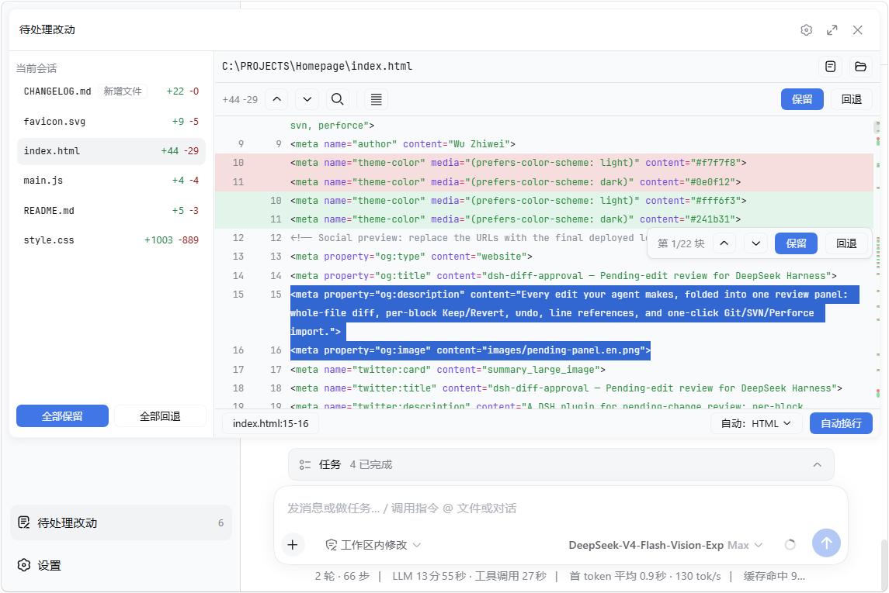
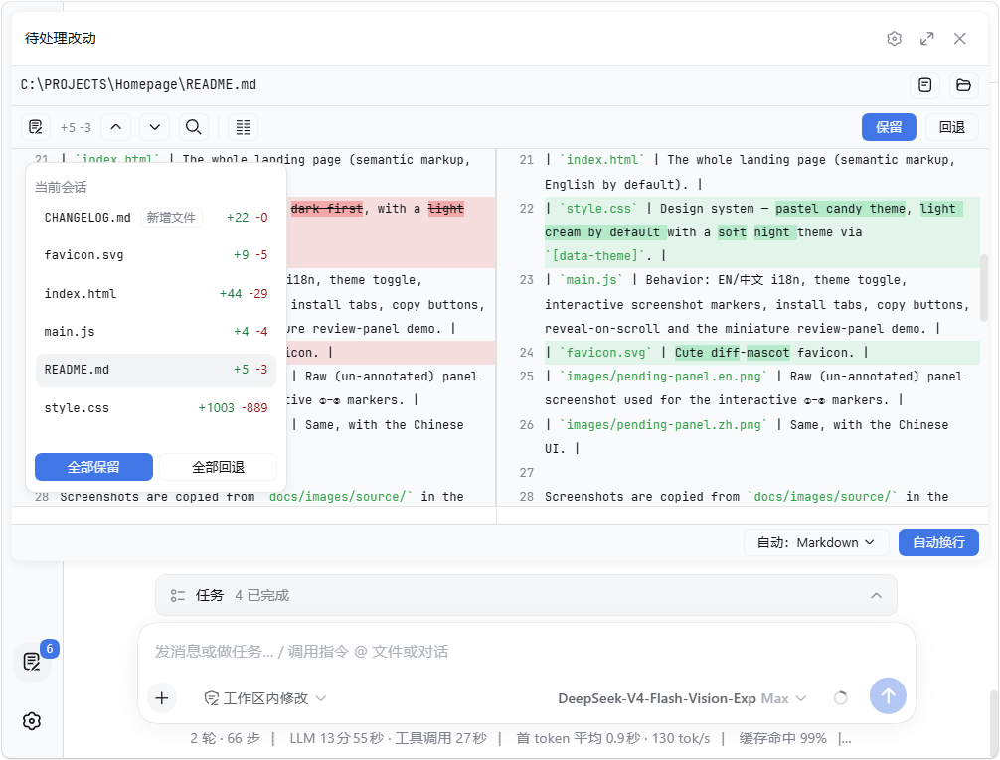
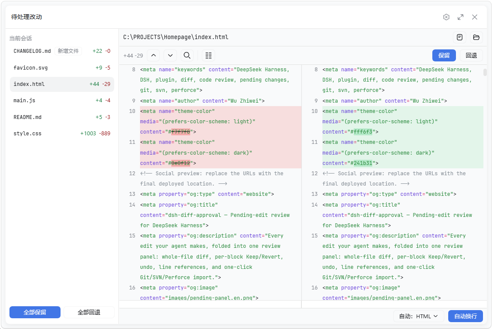
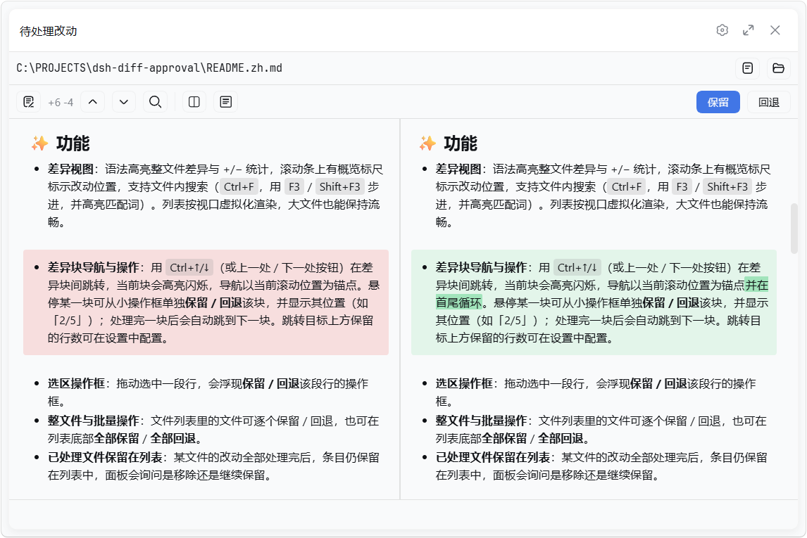

# dsh-diff-approval

[English](README.md) | 中文

[](https://www.npmjs.com/package/dsh-diff-approval)
[](https://github.com/9087/dsh-diff-approval/actions)
[)](https://github.com/9087/dsh-diff-approval/actions/workflows/compat.yml)
[)](https://github.com/9087/dsh-diff-approval/actions/workflows/compat-newer.yml)
[](https://github.com/9087/dsh-diff-approval/actions/workflows/release.yml)

一个 DeepSeek Harness（DSH）待处理改动审核插件：自动跟踪每次成功的 `edit` / `write` / 编辑器（`str_replace_editor`）改动，在侧边栏整合为一个待处理列表，可逐个文件查看完整差异并保留 / 回退，也可以把工作区里版本控制仓库的本地改动一键导入（Git / SVN / Perforce）。



面板还可把文件列表折叠成浮动卡片；浮窗形态下可以逐边选择覆盖左侧边栏、上方标题栏、右侧边栏与下方输入框（四边全开就是原来的全屏，全关则是一张普通浮窗卡片），也可以停靠到右侧边栏、成为其中一个标签页：

打开它的入口有两个：左侧边栏底部那一行，以及会话标题行右侧的按钮簇——也就是 App 放自己会话级操作的地方（「下载 Session 日志」就在那里），所以左侧边栏折叠或隐藏时也能一键叫出审核面板。

| 折叠的文件列表 | 覆盖全部 |
| --- | --- |
|  |  |

对 Markdown 文件，还可把源码行差异切换为渲染后的「改前 / 改后」预览：



## ✨ 功能

- **差异视图**：语法高亮整文件差异与 +/− 统计，滚动条上有概览标尺标示改动位置，支持文件内搜索（`Ctrl+F`，用 `F3` / `Shift+F3` 步进，并高亮匹配词）。列表按视口虚拟化渲染，大文件也能保持流畅。
- **差异块导航与操作**：用 `Ctrl+↑/↓`（或上一处 / 下一处按钮）在差异块间跳转，当前块会高亮闪烁，导航以当前滚动位置为锚点并在首尾循环。悬停某一块可从小操作框单独**保留 / 回退**该块，并显示其位置（如「2/5」）；处理完一块后会自动跳到下一块。跳转目标上方保留的行数可在设置中配置。
- **选区操作框**：拖动选中一段行，会浮现**保留 / 回退**该段行的操作框。
- **整文件与批量操作**：文件列表里的文件可逐个保留 / 回退，也可在列表底部**全部保留** / **全部回退**。
- **已处理文件保留在列表**：某文件的改动全部处理完后，条目仍保留在列表中，面板会询问是移除还是继续保留。
- **撤销 / 重做**：每次保留、回退、导入与**评论**都可以用 `Ctrl+Z` / `Ctrl+Shift+Z` 撤销 / 重做（可在「快捷键」中重绑，`Ctrl+Y` 仍作为别名），面板打开期间全局生效，输入框保留各自的编辑行为。
- **快速呼出与文件切换**：`Ctrl+D`（可在设置中修改）在任意位置开关面板，`Esc` 关闭；左侧栏底部那行、以及会话标题行里 App 自身操作旁的按钮，也都是一键入口；`Ctrl+Tab` / `Ctrl+Shift+Tab` 在待处理文件间切换。
- **行引用**：选中 diff 文本后，底部状态栏显示其 `(文件:行号)` / `(文件:起-止)` 引用——点击（或按 `Ctrl+L`）即可复制，开启设置后还会自动粘贴到消息输入框并获得焦点。消息输入框和排队消息里的引用会随文件改动**自动对齐**：存活的行映射到新行号，整段被删的行变成 `(文件:LINE_MISSING)`。
- **高亮语言**：默认按扩展名自动检测，也可通过下拉列表手动切换。
- **自动换行**：语言下拉旁有个「Wrap lines / 自动换行」开关，按语言记住；CJK 逐字断行、拉丁词保持完整。
- **双栏对比**：可选的双栏视图（左「改前」｜右「当前」），逐行对齐，两侧各自横向滚动、共享纵向滚动条。可在工具栏或设置中切换，默认是单栏（合并）视图。双栏视图按内容相似度对齐改动块，并对改动行做词级差异高亮——拉丁文字按整词、CJK 逐字。
- **Markdown 预览**：对 Markdown 文件可在「源码」行差异与渲染后的「改前 / 改后」预览之间切换。预览内容最大宽度可配置。
- **外观自定义**：在「差异视图」设置组里可调整差异代码字号（%）、行高（px）、新增 / 删除行颜色，以及 Tab 宽度（2 / 4 / 8 空格），并带实时预览。
- **评论与批注**：在任意行上选中一段并写下评论，评论卡片锚定在选中行下方，可以在卡片中与智能体直接探讨相关内容。评论模式默认开启，可以在设置中关闭。智能体可以主动评论（标注）：利用该功能可以要求智能体对相关代码进行标注，提高代码阅读效率。例如说一句「请帮我标注下这个项目的启动流程」，它会把入口、初始化顺序与关键分支的说明逐条标注到对应代码行上，顺着卡片读下来即可。双栏视图里评论会把这次改动的两侧都引用进去（删除行与新增行），智能体看到的是完整的替换。
- **文件菜单**：默认开启（在「差异视图」组里的「文件菜单」一行可关）。它接管了如下一些文件链接的点击操作：外壳「已编辑 / 产出文件」列表里的文件行、消息里的 `@文件` 引用与文件链接、以及本插件 Markdown 预览里的相对链接，并提供：**默认方式打开**（重放外壳自己的行为）、**在审批面板中查看**、**复制文件路径**。
- **内置 CJK 代码字体**：面板内置 JetBrains Maple Mono，按 `unicode-range` 子集化并切片，默认开启，设置中可以关闭。
- **外部改动**：已纳入列表的文件若之后被外部修改（其它工具 / 编辑器），面板会跟进最新内容并标记分歧。
- **打开 / 定位**：查看某个文件的差异时，可一键在默认应用中打开它，或在系统文件管理器中定位它。
- **导入版本控制的改动**：列表为空时，点击按钮即可导入工作区里 **Git / SVN / Perforce** 的本地改动——**凡是没有提交的都算，add 过与否一样**（Git 以最后一次提交为基准，即 `git diff HEAD` 的口径），以及已删除文件，和（可选开启的）VCS 从未见过的文件（未跟踪 / 未版本化）。通过从工作区目录逐级向上查找 VCS 根目录，工作区在子目录里也能识别。
- **持久化**：待处理状态按 workspace 落盘至 `<dshHome>/diff-approval/workspaces/<workspaceId>.json`，跨重启保留——回来时未处理的改动仍在，即便换了新会话。

## 📦 安装

若 `dsh` 已在 `PATH` 中：

```sh
dsh plugin --profile web add dsh-diff-approval
```

若通过 npx 启动 harness（如 `npx @deepseek-ai/dsh web`）：

```sh
npx @deepseek-ai/dsh plugin --profile web add dsh-diff-approval
```

或手动：把本包加入 profile 的 `package.json` 依赖，并在该 profile 的 `cordis.patch.yml` 中加入：

```yaml
- insert:
    - id: diff-approval
      name: dsh-diff-approval
      # 可选：把落盘位置迁到别处（默认是
      # <dshHome>/diff-approval/workspaces）。
      # config:
      #   storageDir: ~/dsh-pending
```

然后重启 `dsh web`。

## 🚀 用法

1. 照常和智能体对话——成功的 `edit` / `write` / 编辑器（`str_replace_editor`）调用会自动记录。
2. 点击侧边栏底部的 **待处理改动** 入口，逐文件查看差异并 **保留 / 回退**。
3. 列表为空时，点 **导入版本控制的改动**，把尚未提交的 Git / SVN / Perforce 改动拉入。

## 📝 注意事项

- 只自动记录被跟踪的改动（`edit`、`write` 与编辑器 `str_replace_editor` 调用）。通过以上工具以外的删除（如 shell `rm`）只能对已跟踪的文件感知：条目显示"文件已不存在"，回退即恢复。
- VCS 导入通过部署环境的 shell 执行器运行只读的 Git / SVN / Perforce 命令，需要对应 CLI 在 `PATH` 中。包含版本控制未跟踪文件（默认关闭）会扫描整个工作区，目录很大时可能较慢。
- 新建文件的整文件回退操作显示为**删除**并移除该文件。
- 回退文件时会保留其当前换行符（LF / CRLF）。
- 没有 workspace 的会话条目仅存内存；损坏的落盘文件会被拒绝，删除即可重置。
- 侧边栏底部入口会与其他插件的入口纵向排列，并在存在专门的 dsh-footer-order 插件时交由它统一管理。

## 🛠 开发

开发环境、命令清单、两个半边各自的生效方式与字体流水线见 [`DEVELOP.md`](DEVELOP.md)。
